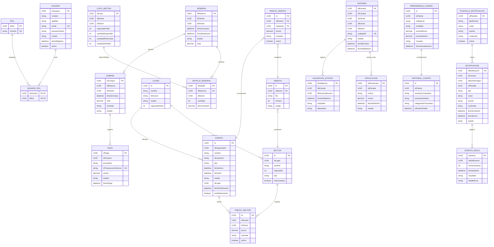

# Modelo de datos

```mermaid
erDiagram
direction TB
    USUARIO {
    UUID idUsuario PK ""  
    string nombre  ""  
    string apellido  ""  
    string email UK ""  
    string passwordHash  ""  
    string ciudad  ""  
    datetime fechaRegistro  ""  
    boolean activo  ""  
    }

	USUARIO_ROL {
		UUID idUsuario PK,FK ""  
		UUID idRol PK,FK ""  
	}

	ROL {
		UUID idRol PK ""  
		string nombre UK ""  
	}
        ASIENTO {
    UUID id PK
    UUID idSector FK
    string fila
    int numero
    string codigo
}
PRECIO_ASIENTO {
UUID id PK
UUID idEvento FK
UUID idAsiento FK
decimal precio
string moneda
boolean activo
}
LUGAR {
UUID id PK ""  
string nombre  ""  
string direccion  ""  
string ciudad  ""  
int capacidadTotal  ""  
}

	SECTOR {
		UUID id PK ""  
		UUID idLugar  ""  
		string nombre  ""  
		int capacidad  ""  
		string tipo  "" 
        boolean esNumerado 
	}

	PRECIO_SECTOR {
		UUID id PK ""  
		UUID idEvento  ""  
		UUID idSector  ""  
		decimal precio  ""  
		string moneda  ""  
		boolean activo  ""  
	}

	RESERVA {
		UUID idReserva PK ""  
		UUID idCliente  ""  
		UUID idEvento  ""  
		datetime fechaCreacion  ""  
		datetime fechaExpiracion  ""  
		string estado  ""  
		decimal total  ""  
	}

	DETALLE_RESERVA {
		UUID idDetalle PK ""  
		UUID idReserva FK ""  
		UUID idSector  ""  
		int cantidad  ""  
		decimal precioUnitario  ""  
	}

	COMPRA {
		UUID idCompra PK ""  
		UUID idReserva  ""  
		UUID idCliente  ""  
		datetime fechaCompra  ""  
		decimal total  ""  
		string moneda  ""  
		string estado  ""  
	}

	PAGO {
		UUID idPago PK ""  
		UUID idCompra  ""  
		string proveedor  ""  
		string idTransaccionExterna UK ""  
		decimal monto  ""  
		string estado  ""  
		datetime fechaPago  ""  
	}

	CUPO_SECTOR {
		UUID idCupo PK ""  
		UUID idEvento  ""  
		UUID idSector  ""  
		int capacidadTotal  ""  
		int cantidadDisponible  ""  
		int cantidadReservada  ""  
		int cantidadVendida  ""  
	}

	ENTRADA {
		UUID idEntrada PK ""  
		UUID idCompra  ""  
		UUID idCliente  ""  
		UUID idEvento  ""  
		UUID idSector  ""  
		string codigoQR UK ""  
		string estado  ""  
		datetime fechaEmision  ""  
		datetime fechaValidacion  ""  
	}

	DEVOLUCION {
		UUID idDevolucion PK ""  
		UUID idEntrada  ""  
		string motivo  ""  
		decimal monto  ""  
		datetime fechaSolicitud  ""  
		string estado  ""  
	}

	VALIDACION_ACCESO {
		UUID idValidacion PK ""  
		UUID idEntrada  ""  
		UUID idPersonalAcceso  ""  
		datetime fechaValidacion  ""  
		string resultado  ""  
		string dispositivo  ""  
	}

	PREFERENCIA_CLIENTE {
		UUID id PK ""  
		UUID idCliente  ""  
		string categorias  ""  
		string ciudades  ""  
		decimal precioMinimo  ""  
		decimal precioMaximo  ""  
		string moneda  ""  
		datetime fechaActualizacion  ""  
	}

	HISTORIAL_CLIENTE {
		UUID id PK ""  
		UUID idCliente  ""  
		string eventosComprados  ""  
		string eventosAsistidos  ""  
		string categoriasFrecuentes  ""  
		datetime ultimaActividad  ""  
	}

	NOTIFICACION {
		UUID idNotificacion PK ""  
		UUID idUsuario  ""  
		UUID idEventoOrigen  ""  
		UUID idPlantilla  ""  
		string tipo  ""  
		string canal  ""  
		string asunto  ""  
		string contenido  ""  
		datetime fechaCreacion  ""  
		datetime fechaEnvio  ""  
		string estado  ""  
	}

	INTENTO_ENVIO {
		UUID idIntento PK ""  
		UUID idNotificacion  ""  
		int numeroIntento  ""  
		datetime fechaIntento  ""  
		string resultado  ""  
		string detalleError  ""  
	}

	PLANTILLA_NOTIFICACION {
		UUID idPlantilla PK ""  
		string tipoEvento  ""  
		string canal  ""  
		string asunto  ""  
		string contenido  ""  
		boolean activa  ""  
	}

	EVENTO {
		UUID id PK ""  
		UUID idOrganizador  ""  
		string nombre  ""  
		string descripcion  ""  
		string tipo  ""  
		datetime fechaInicio  ""  
		datetime fechaFin  ""  
		string estado  ""  
		UUID idLugar  ""  
		datetime fechaPublicacion  ""
        boolean esAltaDemanda  
	}

ASIENTO }o--|| SECTOR : pertenece
PRECIO_ASIENTO }o--|| ASIENTO : establece
PRECIO_ASIENTO }o--|| EVENTO : corresponde
USUARIO||--o{USUARIO_ROL:"tiene"
ROL||--o{USUARIO_ROL:"asignado"
LUGAR||--o{SECTOR:"contiene"
LUGAR||--o{EVENTO:"alberga"
EVENTO||--o{PRECIO_SECTOR:"define"
SECTOR||--o{PRECIO_SECTOR:"tarifado"
RESERVA||--|{DETALLE_RESERVA:"contiene"
RESERVA||--o|COMPRA:"genera"
COMPRA||--o{PAGO:"registra"
CUPO_SECTOR||--o{DETALLE_RESERVA:"disponibilidad"
ENTRADA||--o{DEVOLUCION:"puede_tener"
ENTRADA||--o{VALIDACION_ACCESO:"registra"
PREFERENCIA_CLIENTE||--||HISTORIAL_CLIENTE:"complementa"
NOTIFICACION||--o{INTENTO_ENVIO:"registra"
PLANTILLA_NOTIFICACION||--o{NOTIFICACION:"utiliza"
```
