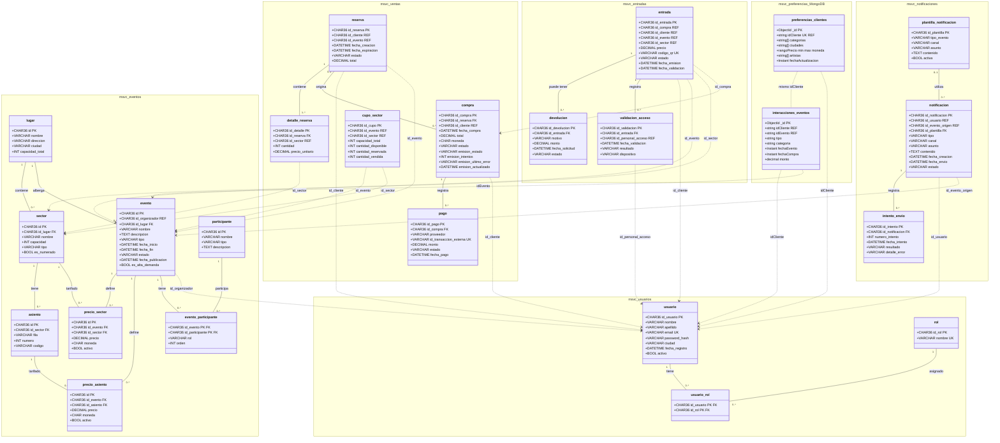

# Modelo de datos

```mermaid
classDiagram
direction TB

namespace msvc_usuarios {
    class usuario {
        +CHAR36 id_usuario PK
        +VARCHAR nombre
        +VARCHAR apellido
        +VARCHAR email UK
        +VARCHAR password_hash
        +VARCHAR ciudad
        +DATETIME fecha_registro
        +BOOL activo
    }
    class rol {
        +CHAR36 id_rol PK
        +VARCHAR nombre UK
    }
    class usuario_rol {
        +CHAR36 id_usuario PK FK
        +CHAR36 id_rol PK FK
    }
}

namespace msvc_eventos {
    class lugar {
        +CHAR36 id PK
        +VARCHAR nombre
        +VARCHAR direccion
        +VARCHAR ciudad
        +INT capacidad_total
    }
    class sector {
        +CHAR36 id PK
        +CHAR36 id_lugar FK
        +VARCHAR nombre
        +INT capacidad
        +VARCHAR tipo
        +BOOL es_numerado
    }
    class asiento {
        +CHAR36 id PK
        +CHAR36 id_sector FK
        +VARCHAR fila
        +INT numero
        +VARCHAR codigo
    }
    class evento {
        +CHAR36 id PK
        +CHAR36 id_organizador REF
        +CHAR36 id_lugar FK
        +VARCHAR nombre
        +TEXT descripcion
        +VARCHAR tipo
        +DATETIME fecha_inicio
        +DATETIME fecha_fin
        +VARCHAR estado
        +DATETIME fecha_publicacion
        +BOOL es_alta_demanda
    }
    class precio_sector {
        +CHAR36 id PK
        +CHAR36 id_evento FK
        +CHAR36 id_sector FK
        +DECIMAL precio
        +CHAR moneda
        +BOOL activo
    }
    class precio_asiento {
        +CHAR36 id PK
        +CHAR36 id_evento FK
        +CHAR36 id_asiento FK
        +DECIMAL precio
        +CHAR moneda
        +BOOL activo
    }
    class participante {
        +CHAR36 id PK
        +VARCHAR nombre
        +VARCHAR tipo
        +TEXT descripcion
    }
    class evento_participante {
        +CHAR36 id_evento PK FK
        +CHAR36 id_participante PK FK
        +VARCHAR rol
        +INT orden
    }
}

namespace msvc_ventas {
    class reserva {
        +CHAR36 id_reserva PK
        +CHAR36 id_cliente REF
        +CHAR36 id_evento REF
        +DATETIME fecha_creacion
        +DATETIME fecha_expiracion
        +VARCHAR estado
        +DECIMAL total
    }
    class detalle_reserva {
        +CHAR36 id_detalle PK
        +CHAR36 id_reserva FK
        +CHAR36 id_sector REF
        +INT cantidad
        +DECIMAL precio_unitario
    }
    class compra {
        +CHAR36 id_compra PK
        +CHAR36 id_reserva FK
        +CHAR36 id_cliente REF
        +DATETIME fecha_compra
        +DECIMAL total
        +CHAR moneda
        +VARCHAR estado
        +VARCHAR emision_estado
        +INT emision_intentos
        +VARCHAR emision_ultimo_error
        +DATETIME emision_actualizado
    }
    class pago {
        +CHAR36 id_pago PK
        +CHAR36 id_compra FK
        +VARCHAR proveedor
        +VARCHAR id_transaccion_externa UK
        +DECIMAL monto
        +VARCHAR estado
        +DATETIME fecha_pago
    }
    class cupo_sector {
        +CHAR36 id_cupo PK
        +CHAR36 id_evento REF
        +CHAR36 id_sector REF
        +INT capacidad_total
        +INT cantidad_disponible
        +INT cantidad_reservada
        +INT cantidad_vendida
    }
}

namespace msvc_entradas {
    class entrada {
        +CHAR36 id_entrada PK
        +CHAR36 id_compra REF
        +CHAR36 id_cliente REF
        +CHAR36 id_evento REF
        +CHAR36 id_sector REF
        +DECIMAL precio
        +VARCHAR codigo_qr UK
        +VARCHAR estado
        +DATETIME fecha_emision
        +DATETIME fecha_validacion
    }
    class devolucion {
        +CHAR36 id_devolucion PK
        +CHAR36 id_entrada FK
        +VARCHAR motivo
        +DECIMAL monto
        +DATETIME fecha_solicitud
        +VARCHAR estado
    }
    class validacion_acceso {
        +CHAR36 id_validacion PK
        +CHAR36 id_entrada FK
        +CHAR36 id_personal_acceso REF
        +DATETIME fecha_validacion
        +VARCHAR resultado
        +VARCHAR dispositivo
    }
}

namespace msvc_notificaciones {
    class plantilla_notificacion {
        +CHAR36 id_plantilla PK
        +VARCHAR tipo_evento
        +VARCHAR canal
        +VARCHAR asunto
        +TEXT contenido
        +BOOL activa
    }
    class notificacion {
        +CHAR36 id_notificacion PK
        +CHAR36 id_usuario REF
        +CHAR36 id_evento_origen REF
        +CHAR36 id_plantilla FK
        +VARCHAR tipo
        +VARCHAR canal
        +VARCHAR asunto
        +TEXT contenido
        +DATETIME fecha_creacion
        +DATETIME fecha_envio
        +VARCHAR estado
    }
    class intento_envio {
        +CHAR36 id_intento PK
        +CHAR36 id_notificacion FK
        +INT numero_intento
        +DATETIME fecha_intento
        +VARCHAR resultado
        +VARCHAR detalle_error
    }
}

namespace msvc_preferencias_MongoDB {
    class preferencias_clientes {
        +ObjectId _id PK
        +string idCliente UK REF
        +string[] categorias
        +string[] ciudades
        +rangoPrecio min max moneda
        +string[] artistas
        +Instant fechaActualizacion
    }
    class interacciones_eventos {
        +ObjectId _id PK
        +string idCliente REF
        +string idEvento REF
        +string tipo
        +string categoria
        +Instant fechaEvento
        +Instant fechaCompra
        +decimal monto
    }
}

%% ---- FK físicas (dentro de cada microservicio) ----
usuario "1" -- "0..*" usuario_rol : tiene
rol "1" -- "0..*" usuario_rol : asignado

lugar "1" -- "0..*" sector : contiene
lugar "1" -- "0..*" evento : alberga
sector "1" -- "0..*" asiento : tiene
evento "1" -- "0..*" precio_sector : define
sector "1" -- "0..*" precio_sector : tarifado
evento "1" -- "0..*" precio_asiento : define
asiento "1" -- "0..*" precio_asiento : tarifado
evento "1" -- "0..*" evento_participante : tiene
participante "1" -- "0..*" evento_participante : participa

reserva "1" -- "1..*" detalle_reserva : contiene
reserva "0..1" -- "0..*" compra : origina
compra "1" -- "0..*" pago : registra

entrada "1" -- "0..*" devolucion : puede tener
entrada "1" -- "0..*" validacion_acceso : registra

plantilla_notificacion "0..1" -- "0..*" notificacion : utiliza
notificacion "1" -- "0..*" intento_envio : registra

preferencias_clientes .. interacciones_eventos : mismo idCliente

%% ---- Referencias lógicas entre microservicios (sin FK) ----
evento ..> usuario : id_organizador
reserva ..> usuario : id_cliente
compra ..> usuario : id_cliente
entrada ..> usuario : id_cliente
validacion_acceso ..> usuario : id_personal_acceso
notificacion ..> usuario : id_usuario
preferencias_clientes ..> usuario : idCliente
interacciones_eventos ..> usuario : idCliente

reserva ..> evento : id_evento
cupo_sector ..> evento : id_evento
entrada ..> evento : id_evento
notificacion ..> evento : id_evento_origen
interacciones_eventos ..> evento : idEvento

detalle_reserva ..> sector : id_sector
cupo_sector ..> sector : id_sector
entrada ..> sector : id_sector

entrada ..> compra : id_compra
```
